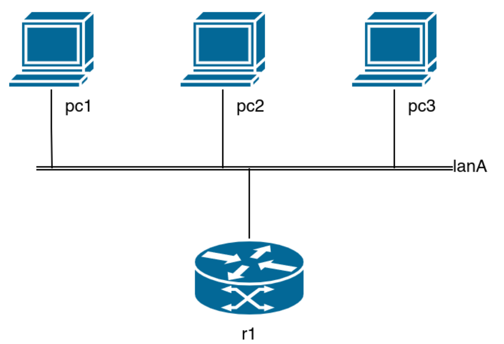

# Task
>A local lan with 3 pc, a default gateway.
>The assignment is: to manually configure pc1, pc2 and pc3 in order to be in the same network than the r1 host, that has IP address 192.168.100.30/29.
>- pc1 should be configured using the interfaces file
>- pc2 should be configured using the ip command
>- pc3 should be configured using the ifconfig command
>
>The default gateway is the r1 machine (already set up)
>
>The **DNS** server can be the server used by the host machine (this has
  to be set in all the pc of the lab) or it can be 8.8.8.8


## Topology



# Solution

First of all we have to understand our *subnet*, and which addresses it is composed of.

We know that `r1` has address `192.168.100.30/29`, which means that we have this subnet:
```
Network:   192.168.100.24/29     11000000.10101000.01100100.00011 000 

HostMin:   192.168.100.25        11000000.10101000.01100100.00011 001
HostMax:   192.168.100.30        11000000.10101000.01100100.00011 110
```

We are going to use this IPs:
- **PC1**: 192.168.100.2**5**
- **PC2**: 192.168.100.2**6**
- **PC3**: 192.168.100.2**7**


## PC1
> PC1 should be configured using the `interfaces` file.

We define a static IPv4 configuration for `eth0`.  
We assign the designated IP from our subnet, point the gateway to `r1`, and set the DNS servers.

📄 **File:** `pc1/etc/network/interfaces.d/eth0`
```text
auto eth0
iface eth0 inet static
  address 192.168.100.25/29
  gateway 192.168.100.30
  dns-nameservers 1.1.1.1 8.8.8.8
```


> [!WARNING]
> Since the images on kathara do not have `resolvconf` to automatically append our DNS configuration to `/etc/esolv.conf`, we must do it **manually**.

📄 **File:** `pc1.startup`
```bash
# 0. Flush the pre-existing conf (not required but best practice)
ip addr flush eth0

# 1. Bring up the interface
ifup eth0

# 2. Configure DNS resolution manually
echo 'nameserver 1.1.1.1' >> /etc/resolv.conf
echo 'nameserver 8.8.8.8' >> /etc/resolv.conf
```

## PC2
> PC2 should be configured using the `ip` command.

📄 **File:** `pc2.startup`
```bash
# 0. Flush the pre-existing conf (not required but best practice)
ip addr flush eth0

# 1. Assign the designated IP from the subnet
ip addr add 192.168.100.26/29 dev eth0

# 2. Point the gateway to r1
ip route add default via 192.168.100.30

# 3. Bring up the interface
ip link set eth0 up

# 4. Configure DNS resolution
echo 'nameserver 1.1.1.1' >> /etc/resolv.conf
echo 'nameserver 8.8.8.8' >> /etc/resolv.conf
```

## PC3
> PC3 should be configured using the `ifconfig` command.

📄 **File:** `pc3.startup`
```bash
# 0. Flush the pre-existing conf (not required but best practice)
ip addr flush eth0

# 1. Assign the designated IP from the subnet
ifconfig eth0 192.168.100.27/29

# 2. Point the gateway to r1
route add default gw 192.168.100.30

# 3. Bring up the interface
ifconfig eth0 up

# 4. Configure DNS resolution
echo 'nameserver 1.1.1.1' >> /etc/resolv.conf
echo 'nameserver 8.8.8.8' >> /etc/resolv.conf
```
