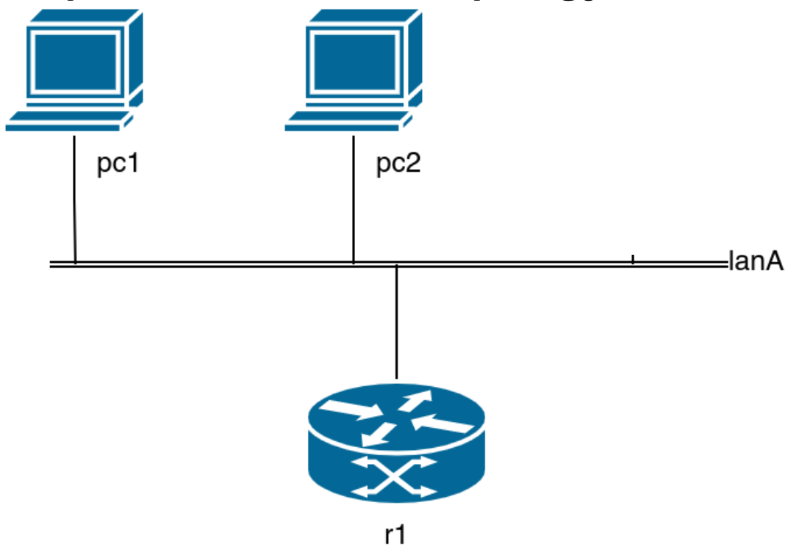

# Task
>A local lan with 2 pcs, a default gateway that also operates as a DHCP server.  
>The assignment is: to manually configure r1 to act as DHCP server and the 2 pcs to request an IP address from it.
>- `r1` is set up with the IP address 192.168.100.30/28. It should use
>  the network 192.168.100.16/28 as the address pool
>- the DNS server can be the server used by the host machine (this has to be set in all the pc of the lab)
>- the default gateway is r1
>
>Then:
>- `pc1` should be configured using the interfaces file
>- `pc2` should be configured using the dhclient command


## Topology
<p align="center">
  
</p>


# Solution
First of all let's understand the **subnet** that our DHCP server is going to use, 192.168.100.16/28.
```
Network:   192.168.100.16/28     11000000.10101000.01100100.0001 0000 

HostMin:   192.168.100.17        11000000.10101000.01100100.0001 0001
HostMax:   192.168.100.30        11000000.10101000.01100100.0001 1110
```


## R1
We must then setup the **DHCP Server** on `r1`, to do so we have to configure the file used by **udhcpd**.

📄 **File:** `r1/etc/udhcpd.conf`
```bash
# The start and end of the IP lease block (the last IP is for r1)
start 192.168.100.17
end   192.168.100.29

# The interface that udhcpd will use
interface eth0

# Options
opt dns 1.1.1.1 8.8.8.8
opt subnet 255.255.255.240
opt router 192.168.100.30
```

And then tell `r1` to use it.

> [!NOTE]
> The `eth1` interface of `r1` is the one connected to the outside.

📄 **File:** `r1.startup`
```diff
# 1. Set the IP of r1
ip addr replace 192.168.100.30/28 dev eth0

# 2. NAT all traffic directed outside the LAN
iptables -t nat -A POSTROUTING -o eth1 -j MASQUERADE

# 3. Install UDHCPD
dpkg -i /var/cache/apt/archives/*.deb
apt install -f udhcpd

# 4. Make UDHCPD read the conf
+ udhcpd /etc/udhcpd.conf

# 5. Configure DNS resolution manually
+ echo "nameserver 1.1.1.1" > /etc/resolv.conf
+ echo "nameserver 8.8.8.8" >> /etc/resolv.conf
```

## PC1
>`PC1` should be configured using the interfaces file

We must make the interface automatically request the IP from the DHCP server.

📄 **File:** `pc1/etc/network/interfaces.d/eth0`
```text
auto eth0
iface eth0 inet dhcp
```

📄 **File:** `pc1.startup`
```bash
# 0. Flush the pre-existing conf (not required but best practice)
ip addr flush eth0

# 1. Bring up the interface
ifup eth0

# 2. Configure DNS resolution manually
echo "nameserver 1.1.1.1" > /etc/resolv.conf
echo "nameserver 8.8.8.8" >> /etc/resolv.conf
```

## PC2
> `PC2` should be configured using the dhclient command

The `dhclient` command automatically configures the interface with dhcp.

📄 **File:** `pc2.startup`
```bash
# 0. Flush the pre-existing conf (not required but best practice)
ip addr flush eth0

# 1. Request the configuration for eth0 from the DHCP server
dhclient eth0

# 2. Configure DNS resolution manually
echo "nameserver 1.1.1.1" > /etc/resolv.conf
echo "nameserver 8.8.8.8" >> /etc/resolv.conf
```
# Tests
To make sure our lab is configured correctly, we can do some tests, as the slides state:
> Verify connectivity within the network and with the Internet (ex: `ping www.google.com`)

First let's [start the lab](../../README.md#color-coded-terminal-launcher-lstartsh) on our host machine.
```bash
host:~$ git lstart
```

We can then check what IPs were assigned to `pc1` and `pc2`.  
First on `pc1`
```console
root@pc1:/# ip -4 addr show eth0
30: eth0@if29: <BROADCAST,MULTICAST,UP,LOWER_UP> mtu 1500 qdisc noqueue state UP group default qlen 1000 link-netnsid 0
    inet 192.168.100.29/28 brd 192.168.100.31 scope global dynamic eth0
       valid_lft 863884sec preferred_lft 863884sec
```

And then on `pc2`
```console
root@pc2:/# ip -4 addr show eth0
35: eth0@if34: <BROADCAST,MULTICAST,UP,LOWER_UP> mtu 1500 qdisc noqueue state UP group default qlen 1000 link-netnsid 0
    inet 192.168.100.22/28 brd 192.168.100.31 scope global dynamic eth0
       valid_lft 863738sec preferred_lft 863738sec
```


So we have:
- `pc1`: 192.168.100.29/28
- `pc2`: 192.168.100.22/28


## Intra-LAN Tests
We can test to see if the hosts can reach one another, to ensure connectivity **through the LAN**.  
Let's try from both hosts:
- [x] **PC1 to PC2 (Cross-LAN):**
```console
root@pc1:/# ping -c 1 192.168.100.22
```
- [x] **PC2 to Default Gateway:**
```console
root@pc2:/# ping -c 1 192.168.100.30
```

## Internet Connectivity
We can then test the **internet connection**:

- [x] **PC1 Internet Connectivity:**
```console
root@pc1:/# ping -c 1 google.com
```
- [x] **R1 (Gateway) Internet Connectivity:**
```console
root@r1:/# ping -c 1 google.com
```


# Capturing Packets
As one of the [lab1/ex4](../ex4/) activities, we have to capture the traffic between the DHCP server and client.

We can achieve it in two ways:
- Using `tcpdump` on `r1`.
- Connecting to the network with the `connect-lab.sh` and using `wireshark` to sniff the traffic.

We are going to proceed with the latter, for no particular reason.

## Setup the lab
To make sure that we can intercept the packets exchanged between the client/server, we must first remove the commands that automatically start the dhcp client.

To act as a client, we will use `pc1`.  
We must comment out the `ifup eth0` instruction in its startup file so it doesn't request an IP immediately upon boot.

📄 **File:** `pc1.startup`
```bash
... [Rest of the config] ...
# 1. Bring up the interface
# ifup eth0
... [Rest of the config] ...
```


## Setup the listener
First let's [start the lab](../../README.md#color-coded-terminal-launcher-lstartsh) on our host machine.
```bash
host:~$ git lstart
```

Then we must [connect to the lanA](../../README.md#host-to-lab-network-bridge), using an available address.
```bash
host:~$ git connect-lab 192.168.100.29/28 lanA
```


We then open `wireshark`, and start to **listen** on the `veth0` interface.

To make the client start the DHCP exchange, we go on `pc1` and we type
```console
root@pc1:/# ifup eth0
```

We can see the packets being captured from Wireshark.

Once we collected the data (that can be found in the [dhcp.pcap](./captures/dhcp.pcap)), we can analyze it.


If we type in the display filter bar `dhcp` we can take a look at the messages, exchanged between the client and server, to get a lease.


If we want to look at it schematically it looks like this:
```text
CLIENT (0.0.0.0)                                     SERVER (192.168.100.30)
      |                                                        |
      | -------- [1] DHCP Discover (Broadcast) --------------> |
      |                                                        |
      | <------- [2] DHCP Offer (IP: 192.168.100.22) --------- |
      |                                                        |
      | -------- [3] DHCP Request (Broadcast) ---------------> |
      |                                                        |
      | <------- [4] DHCP ACK (Lease Confirmed) -------------- |
```
