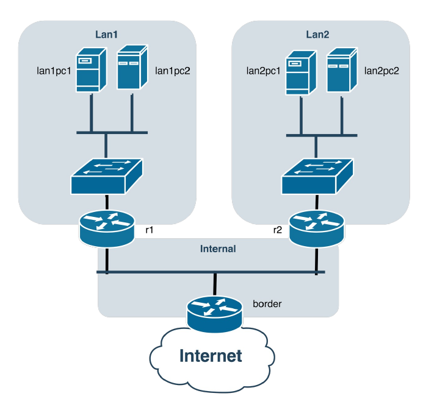

# Task
>Two lan, both with 2 pc and one router.  
>Then, another lan that joins the two routers with a border gateway (r0).  
>The assignment is: to configure the 4 pc and the three routers so that the two lans are reachable and all can reach the Internet.
>- You have to use the 172.16.0.0/16 network and assign subnetworks to all the LANs in the topology. Think about the most suitable approach.
>- r0 has to be the default gateway of the whole network. It is already set up to act as the default gateway. It is connected to the internet via eth0.
>- r1 and r2 have to be the default gateways for "lan1" and "lan2", respectively. They have to have a default route towards r0 and static routes to reach lan1 or lan2. To set up static routes you can use the ip route command (man ip-route).
>- the DNS server can be the server used by the host machine (this has to be set in all the pcs of the lab) or 8.8.8.8
>- the PCs can be configured as you prefer

## Topology

<p align="center">
  
</p>

# Solution
First of all, let's understand how to split the subnets for the different networks.
We have the **172.16.0.0/16** network.  
As suggested by the professor, we can split this into 3 subnets:
- **Lan1**: 172.16.1.0/24
- **Lan2**: 172.16.2.0/24
- **Internal**: 172.16.254.0/24

Since we are free to configure the PCs as we prefer, we are going to use the `ip` command to statically assign IPs in Lan1, and setup `udhcpd` on `r2`, to dynamically assign IPs in Lan2.

## Lan1
We statically configure Lan1 IPs.  
First we configure `r1`.


📄 **File:** `r1.startup`
```bash
# 0. Flush the pre-existing confs (not required but best practice)
ip addr flush eth0
ip addr flush eth1

# 1. Setup eth1 interface towards Lan1
ip addr add 172.16.1.254/24 dev eth1
ip link set eth1 up

# 2. Setup eth0 interface toward Internal
ip addr add 172.16.254.1/24 dev eth0
ip link set eth0 up

# 3. Add default Gateway
ip route add default via 172.16.254.254

# 4. Add static route to reach Lan2
ip route add 172.16.2.0/24 via 172.16.254.2

# 5. Configure DNS resolution manually
echo "nameserver 1.1.1.1" >> /etc/resolv.conf
echo "nameserver 8.8.8.8" >> /etc/resolv.conf
```

Then we statically configure `lan1pc1` and `lan1pc2`, assigning:
- `lan1pc1`: 172.16.1.1
- `lan1pc2`: 172.16.1.2

### Lan1PC1

📄 **File:** `lan1pc1.startup`
```bash
# 0. Flush the pre-existing conf (not required but best practice)
ip addr flush eth0

# 1. Assign the designated IP from the subnet
ip addr add 172.16.1.1/24 dev eth0

# 2. Bring up the interface
ip link set eth0 up

# 3. Add the default gateway (r1)
ip route add default via 172.16.1.254

# 4. Configure DNS resolution manually
echo "nameserver 1.1.1.1" >> /etc/resolv.conf
echo "nameserver 8.8.8.8" >> /etc/resolv.conf
```

### Lan1PC2
📄 **File:** `lan1pc2.startup`
```bash
# 0. Flush the pre-existing conf (not required but best practice)
ip addr flush eth0

# 1. Assign the designated IP from the subnet
ip addr add 172.16.1.2/24 dev eth0

# 2. Bring up the interface
ip link set eth0 up

# 3. Add the default gateway (r1)
ip route add default via 172.16.1.254

# 4. Configure DNS resolution manually
echo "nameserver 1.1.1.1" >> /etc/resolv.conf
echo "nameserver 8.8.8.8" >> /etc/resolv.conf
```

## Lan2
We setup a dhcp server on `r2` and the clients on `lan2pc1` and `lan2pc2`.  
First we create the conf file for dhcp.

📄 **File:** `r2/etc/udhcpd.conf`
```bash
# The start and end of the IP lease block (the last IP is for r2)
start 172.16.2.1
end   172.16.2.253

# The interface that udhcpd will use
interface eth1

# Options
opt dns 1.1.1.1 8.8.8.8
opt subnet 255.255.255.0
opt router 172.16.2.254
```

Then we make `r2` use it, and configure the rest.

📄 **File:** `r2.startup`
```bash
# 0. Flush the pre-existing confs (not required but best practice)
ip addr flush eth0
ip addr flush eth1

# 1. Setup eth1 interface towards Lan2
ip addr add 172.16.2.254/24 dev eth1
ip link set eth1 up

# 2. Install UDHCPD
dpkg -i /var/cache/apt/archives/*.deb
apt install -f udhcpd

# 3. Make UDHCPD read the conf for Lan2
udhcpd /etc/udhcpd.conf

# 4. Setup eth0 interface toward Internal
ip addr add 172.16.254.2/24 dev eth0
ip link set eth0 up

# 5. Add default Gateway
ip route add default via 172.16.254.254

# 6. Add static route to reach Lan1
ip route add 172.16.1.0/24 via 172.16.254.1

# 7. Configure DNS resolution manually
echo "nameserver 1.1.1.1" >> /etc/resolv.conf
echo "nameserver 8.8.8.8" >> /etc/resolv.conf
```

We can finally configure `lan2pc1` and `lan2pc2` to ask the dhcp server for IPs.

### Lan2PC1

📄 **File:** `lan2pc1.startup`
```bash
# 0. Flush the pre-existing conf (not required but best practice)
ip addr flush eth0

# 1. Request the configuration for eth0 from the DHCP server
dhclient eth0

# 2. Configure DNS resolution manually
echo 'nameserver 1.1.1.1' >> /etc/resolv.conf
echo 'nameserver 8.8.8.8' >> /etc/resolv.conf
```

### Lan2PC2
📄 **File:** `lan2pc2.startup`
```bash
# 0. Flush the pre-existing conf (not required but best practice)
ip addr flush eth0

# 1. Request the configuration for eth0 from the DHCP server
dhclient eth0

# 2. Configure DNS resolution manually
echo 'nameserver 1.1.1.1' >> /etc/resolv.conf
echo 'nameserver 8.8.8.8' >> /etc/resolv.conf
```
