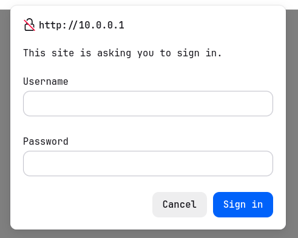

# Task
Deploy packet sniffers (`tcpdump`) to capture network traffic while interacting with various application-layer services.  
Use Wireshark to analyze the resulting `.pcap` files, extract sensitive information, and compare the behaviors of secure versus insecure protocols.

> [!NOTE]
> **Cross-Exercise Captures:** 
> Per the assignment, traffic captures were also generated for the DHCP handshake (ex2) and Inter-LAN routing (ex3).  
To maintain proper context, the `.pcap` files and the analysis for those specific protocol exchanges are located within their respective exercise directories.
> - [ ] TODO: Complete Activity 5 about [CTF of Hack3rCon 3 conference (2012)](https://drive.google.com/file/d/1ANd0t_U7Ya8R1fppcHhi51WYq9FjltM6/view).


# Solution

The core of this exercise focuses on observing how unencrypted application-layer protocols transmit data across a network, and how easily a passive listener can extract sensitive credentials.  

To do so, we are going to connect to the network with the `connect-lab.sh` and using `wireshark` to sniff the traffic.

First of all let's [start the lab](../../README.md#color-coded-terminal-launcher-lstartsh) on our host machine.
```bash
host:~$ git lstart
```

Then we must [connect to the lan](../../README.md#host-to-lab-network-bridge), using an available address.
```bash
host:~$ git connect-lab 10.0.0.2/24 lanA
```

For each activity we are going to listen on `veth0`, and then generate the traffic.  
The resulting `*.pcap` can be found in [captures/](./captures/).

## 1. Web Traffic: `da.php` vs. `ba.php`
In this scenario, we captured traffic while authenticating against two local PHP pages using native HTTP authentication schemes, using the credentials `angelo:angsp`.

Both pages, present at `http://10.0.0.1/da.php` and `http://10.0.0.1/ba.php`, prompt us to login:
<p align="center">
  
</p>


### Analyzing `ba.php` (HTTP Basic Authentication)
In this page the server forces authentication by checking for valid credentials and returning a `401` status if they are missing:
  ```php
  if ($_SERVER['PHP_AUTH_USER']!='angelo' || $_SERVER['PHP_AUTH_PW'] !='angsp') {
      header('WWW-Authenticate: Basic realm="'.$realm.'"');
  ```
Analyzing the capture we can see that the browser prompts the user, concatenates the input as `angelo:angsp`, and encodes it in Base64 before sending it in the `Authorization: Basic` HTTP header. 
The resulting string is `YW5nZWxvOmFuZ3Nw`.


Base64 is an encoding format, *not* encryption. In Wireshark, expanding the HTTP headers decodes the string in plain text. A passive listener immediately compromises the credentials.

### Analyzing `da.php` (HTTP Digest Authentication)
This page is designed to fix the flaws of Basic Auth.  
Digest Auth forces the browser to prove it knows the password without ever actually sending it. The server issues a challenge containing a unique `nonce` (Number used only ONCE):
  ```php
  header('WWW-Authenticate: Digest realm="'.$realm.'",qop="auth",nonce="'.uniqid().'"...');
  ```

Instead of sending the password, the browser calculates a MD5 hash combining the username, password, realm, and the server's `nonce`.  
It sends this hash back in the `response` field. The server performs the same mathematical operation locally to verify:
  ```php
  $A1 = md5($data['username'] . ':' . $realm . ':' . $users[$data['username']]);
  // ... (math continues to generate $valid_response)
  if ($data['response'] != $valid_response) die('Wrong Credentials!');
  ```

When analyzing this exchange in Wireshark, the string `angsp` is nowhere to be found. Because cryptographic hashes are, supposedly, one-way functions, a passive attacker only sees a randomized hash string that cannot be easily reversed or replayed.


## 2. File Transfer: FTP vs. SFTP
In this scenario, we captured traffic while authenticating against an external test server (`test.rebex.net`) using the credentials `demo:password`.

### Analyzing FTP (File Transfer Protocol)
Traditional FTP operates primarily over TCP port 21 for control/commands.  
By applying the `ftp` filter in Wireshark, the entire authentication sequence is laid bare.  
Since FTP is a strictly plaintext protocol, we can see the exact packets where the client sends the `USER demo` command, followed immediately by the `PASS password` command.
> [!TIP] 
> Right-clicking any of the FTP packets and selecting **Follow > TCP Stream** displays the entire client-server conversation in a highly readable, color-coded text window, completely exposing the credentials and directory listings.

### Analyzing SFTP (SSH File Transfer Protocol)
SFTP operates over an encrypted Secure Shell (SSH) tunnel, typically on TCP port 22.  
When filtering for `ssh` or `tcp.port == 22`, we see the initial TCP handshake, followed by the SSH protocol version exchange and Key Exchange Init.

After the key exchange, all subsequent packets are labeled simply as `Encrypted packet` or `SSHv2 Encrypted packet`.  
Unlike FTP, it is impossible to read the `USER` or `PASS` commands. The payload is entirely obfuscated, protecting both the credentials and the transferred file data from passive sniffing.
