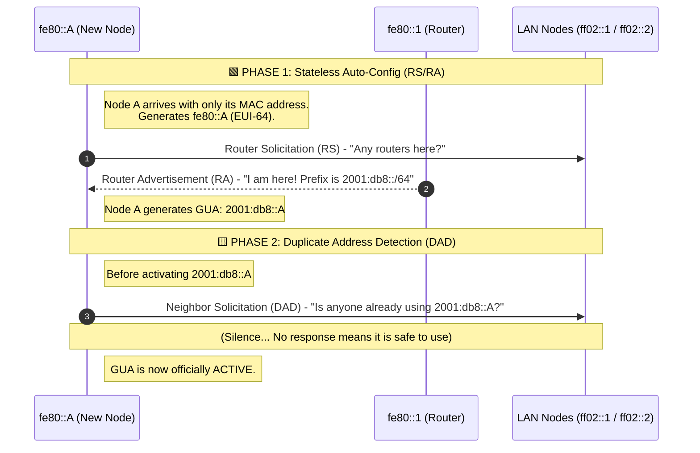

# Task
>One router with two lans with two pcs. 
>
> The assignment is: to configure the topology to use SLAAC IPv6 addresses.  
The router is already configured to advertise prefixes in both the lans.
>
>You should check the sysctl ipv6 settings. Sysctl write can only be done in the lab.conf OR in a priviledged container.
>
>- All the pcs of the topology must have GUA addresses.
>
>- pc1 has to use the default configuration for the Interface ID
>
>- pc2 has to use a Random Interface ID
>
>- pc3 has to use stable privacy extension, setting the stable_secret
>
>- pc4 has to use the EUI-64 and use the temporary addresses. Set up
>  a short lifetime in order to see multiple addresses.
>
>- router r1 is already set up. You only have to turn on the radvd server
>  to capture the router advertisement packets using tcpdump.
>  See the r1.startup and the /etc/radvd.conf file.
>
>Remember to check the list of all the possible IPv6 settings in:
>https://www.kernel.org/doc/Documentation/networking/ip-sysctl.txt


# Solution
This is the first lab that actually must be launched with the `--privileged` flag, starting it with [our script](../../README.md#color-coded-terminal-launcher-lstartsh) works normally.

Let's take a look at the subnets defined by `r1`:

📄 **File:** `r1/etc/network/interfaces`
```bash
iface eth0 inet6 static
  address 2001:db8:cafe:1::1
  netmask 64
  dad-attempts 0
iface eth1 inet6 static
  address 2001:db8:cafe:2::1
  netmask 64
  dad-attempts 0
```

So we have:
- `lan1`: 2001:db8:cafe:1::1/64
- `lan2`: 2001:db8:cafe:2::1/64

We now have to setup all GUA addresses using SLAAC.
## PC1
>`pc1` has to use the default configuration for the Interface ID

In this case we only have to tell `pc1` that:
- It shouldn't **forward** messages (this is needed, to make linux understand that it's a PC and not a Router)
- It should accept **router advertisements**


📄 **File:** `pc1.startup`
```bash
#1. Disable forwarding
sysctl -w net.ipv6.conf.eth0.forwarding=0

#2. Accept Router Advertisements
sysctl -w net.ipv6.conf.eth0.accept_ra=1
```

## PC2
> `pc2` has to use a Random Interface ID

> [!NOTE]
>Here, to use a Random Interface ID we have to set `addr_gen_mode`, that can have 4 values:
>- 0: generate address based on EUI64 (default)
>- 1: do no generate a link-local address, use EUI64 for addresses generated from
autoconf
>- 2: generate stable privacy addresses, using the secret from stable_secret
>(RFC7217, see stable_secret parameter)
>   - This allows for a balance between privacy and stability
>- 3: generate stable privacy addresses, using a random secret if unset


We're gonna set `addr_gen_mode` to **3**.

Since we want to have a **new** Link-Local address, we are gonna:
- Set the configuration
- **Flush** the addresses
- **Bounce** the interface (up & down)

📄 **File:** `pc2.startup`
```bash
#1. Disable forwarding
sysctl -w net.ipv6.conf.eth0.forwarding=0

#2. Accept Router Advertisements
sysctl -w net.ipv6.conf.eth0.accept_ra=1

#3. Set address' generation modality
sysctl -w net.ipv6.conf.eth0.addr_gen_mode=3

#4. Flush the pre-generated addresses
ip addr flush eth0

#5. Bounce the interface
ip link set eth0 down
ip link set eth0 up
```

## PC3
> `pc3` has to use stable privacy extension, setting the stable_secret

This is similar to the `pc2` configuration, but we have to set the `stable_secret`.  
Reading the documentation:

> [!NOTE]
> stable_secret - IPv6 address  
>
> >This IPv6 address will be used as a secret to generate IPv6 addresses for link-local addresses and autoconfigured ones. All addresses generated after setting this secret will be stable privacy ones by default. This can be changed via the addrgenmode ip-link. conf/default/stable_secret is used as the secret for the namespace, the interface specific ones can overwrite that. Writes to conf/all/stable_secret are refused.  
>>
> >It is recommended to generate this secret during installation of a system and keep it stable after that.  
>>
>> By default the stable secret is unset.


So we can set it with a random generated IPv6 address (we're gonna use ::1 for simplicity)

Here too we need to **flush** and **bounce** the interface in the end.

📄 **File:** `pc3.startup`
```bash
#1. Disable forwarding
sysctl -w net.ipv6.conf.eth0.forwarding=0

#2. Accept Router Advertisements
sysctl -w net.ipv6.conf.eth0.accept_ra=1

#3. Set the stable secret
sysctl -w net.ipv6.conf.eth0.stable_secret=::1

#4. Set address' generation modality
sysctl -w net.ipv6.conf.eth0.addr_gen_mode=2

#5. Flush the pre-generated addresses
ip addr flush eth0

#6. Bounce the interface
ip link set eth0 down
ip link set eth0 up
```

## PC4
> `pc4` has to use the EUI-64 and use the temporary addresses. Set up
>  a short lifetime in order to see multiple addresses.

> [!NOTE]
> use_tempaddr - INTEGER
> 
>> Preference for Privacy Extensions (RFC3041).
>> 
>>><= 0 : disable Privacy Extensions
>>>
>>>== 1 : enable Privacy Extensions, but prefer public addresses over temporary addresses.
>>>
>>> 1 : enable Privacy Extensions and prefer temporary addresses over public addresses.
>> 
>>Default:
>> 
>> >0 (for most devices)
>> > 
>> >-1 (for point-to-point devices and loopback devices)
>> 
> temp_valid_lft - INTEGER
>> 
>>valid lifetime (in seconds) for temporary addresses. If less than the minimum required lifetime (typically 5-7 seconds), temporary addresses will not be created.
>> 
>>Default: 172800 (2 days)


So we're gonna set `use_tempaddr` to 2, and `temp_valid_lft` to 15s.


📄 **File:** `pc4.startup`
```bash
#1. Disable forwarding
sysctl -w net.ipv6.conf.eth0.forwarding=0

#2. Accept Router Advertisements
sysctl -w net.ipv6.conf.eth0.accept_ra=1

#3. Prefer temporary addresses
sysctl -w net.ipv6.conf.eth0.use_tempaddr=2

#4. Set lifetime of 15s for temporary addresses
sysctl -w net.ipv6.conf.eth0.temp_valid_lft=15

#5. Flush the pre-generated addresses
ip addr flush eth0

#6. Bounce the interface
ip link set eth0 down
ip link set eth0 up
```

# Tests
To make sure our lab is configured correctly, we can do some tests.

First let's start the lab ([take a look at the git alias](../../README.md#color-coded-terminal-launcher-lstartsh)) on our host machine.
```bash
host:~$ git lstart
```

## Check Addresses
Then, on `r1`, we start `radvd`(*R*outer *ADV*ertisement *D*aemon).
```console
root@r1:/# radvd -m logfile -l /var/log/radvd.log
```

We can then check that every Host is correctly generating/receiving the IPs.

### PC1
On `pc1` we should have:
- The standard generated, EUI-64 Link-Local address
- The GUA address of `lan1` taken with SLAAC from `r1`, and generated too with EUI-64

And in fact, if we check:
```console
root@pc1:/# ip a s eth0
325: eth0@if324: <BROADCAST,MULTICAST,UP,LOWER_UP> mtu 1500 qdisc noqueue state UP group default qlen 1000
    link/ether 96:d6:35:ea:a0:b7 brd ff:ff:ff:ff:ff:ff link-netnsid 0
    inet6 2001:db8:cafe:1:94d6:35ff:feea:a0b7/64 scope global dynamic mngtmpaddr proto kernel_ra 
       valid_lft 86385sec preferred_lft 14385sec
    inet6 fe80::94d6:35ff:feea:a0b7/64 scope link proto kernel_ll 
       valid_lft forever preferred_lft forever
```

We can see that we have:
- MAC Address: `96:d6:35:ea:a0:b7`
- GUA: `2001:db8:cafe:1:94d6:35ff:feea:a0b7/64`
- Link-Local `fe80::94d6:35ff:feea:a0b7/64`

So it has:
- GUA is in the subnet advertised, `2001:db8:cafe:1::1/64`
- Link-Local address is generated as EUI-64 starting from the MAC.

> [!NOTE]
> Kathara generates a new MAC address when you restart the lab, so it's not going to have the same EUI-64.

### PC2
On `pc2` we should have:
- The random generated Link-Local address
- The GUA address of `lan1` taken with SLAAC from `r1`, with a random generated host part.

And if we check:
```console
root@pc2:/# ip a s eth0
331: eth0@if330: <BROADCAST,MULTICAST,UP,LOWER_UP> mtu 1500 qdisc noqueue state UP group default qlen 1000
    link/ether 02:7f:f5:a2:bc:2e brd ff:ff:ff:ff:ff:ff link-netnsid 0
    inet6 2001:db8:cafe:1:4bc3:efce:b91:9c82/64 scope global dynamic mngtmpaddr stable-privacy proto kernel_ra 
       valid_lft 86378sec preferred_lft 14378sec
    inet6 fe80::97ff:3ffd:a5a8:47b6/64 scope link stable-privacy proto kernel_ll 
       valid_lft forever preferred_lft forever
```
We can see that we have:
- MAC Address: `02:7f:f5:a2:bc:2e`
- GUA: `2001:db8:cafe:1:4bc3:efce:b91:9c82/64`
- Link-Local `fe80::97ff:3ffd:a5a8:47b6/64`

So it has:
- GUA is in the subnet advertised, `2001:db8:cafe:1::1/64`
- Link-Local address is generated randomly starting from a secret generated at boot.  
In fact if we restart the LAB, we can see that the Link-Local address changes.

### PC3
On `pc3` we should have:
- The random generated Link-Local address, starting from the Stable Secret
- The GUA address of `lan2` taken with SLAAC from `r1`, with a random generated host part, starting from the Stable secret.

If we check:
```console
root@pc3:/# ip a s eth0
345: eth0@if344: <BROADCAST,MULTICAST,UP,LOWER_UP> mtu 1500 qdisc noqueue state UP group default qlen 1000
    link/ether 46:80:3a:ed:56:22 brd ff:ff:ff:ff:ff:ff link-netnsid 0
    inet6 2001:db8:cafe:2:6cab:58f3:dc5a:936e/64 scope global dynamic mngtmpaddr stable-privacy proto kernel_ra 
       valid_lft 86394sec preferred_lft 14394sec
    inet6 fe80::69f8:7ff8:dae6:e2a4/64 scope link stable-privacy proto kernel_ll 
       valid_lft forever preferred_lft forever
```

We can see that we have:
- MAC Address: `46:80:3a:ed:56:22`
- GUA: `2001:db8:cafe:2:6cab:58f3:dc5a:936e/64`
- Link-Local `fe80::69f8:7ff8:dae6:e2a4/64`

So it has:
- GUA is in the subnet advertised, `2001:db8:cafe:2::1/64`
- Link-Local address is generated randomly starting from the stable_secret set.  
In fact if we restart the LAB, we can see that the Link-Local address and the Host part of the GUA **do not change**.

> [!NOTE]
> In this case, and the one before, the Host part of the GUA and the Link-Local address are different, because when generating them, the kernel uses the **Network Prefix** to hash it.  
> So, having in one case we have `fe80::` and in the other `2001:db8:cafe:2::`, they are gonna produce different outputs.

### PC4
On `pc4` we should have:
- The standard generated, EUI-64 Link-Local address
- A **temporary** GUA address of `lan2` taken with SLAAC from `r1`

If we check:
```console
root@pc4:/# ip a s eth0
363: eth0@if362: <BROADCAST,MULTICAST,UP,LOWER_UP> mtu 1500 qdisc noqueue state UP group default qlen 1000
    link/ether 72:ce:e3:06:05:af brd ff:ff:ff:ff:ff:ff link-netnsid 0
    inet6 2001:db8:cafe:2:e3e8:cf14:c14c:660d/64 scope global temporary dynamic 
       valid_lft 13sec preferred_lft 13sec
    inet6 2001:db8:cafe:2:4569:589:c1ef:6189/64 scope global temporary dynamic 
       valid_lft 3sec preferred_lft 3sec
    inet6 2001:db8:cafe:2:70ce:e3ff:fe06:5af/64 scope global dynamic mngtmpaddr proto kernel_ra 
       valid_lft 86388sec preferred_lft 14388sec
    inet6 fe80::70ce:e3ff:fe06:5af/64 scope link proto kernel_ll 
       valid_lft forever preferred_lft forever
```

We can see something strange here:
- MAC Address: `72:ce:e3:06:05:af`
- The new temporary generated GUA:`2001:db8:cafe:2:e3e8:cf14:c14c:660d/64`, with a lifetime of 13s.
- The old temporary generated GUA: `2001:db8:cafe:2:4569:589:c1ef:6189/64`, with a lifetime of 3s.
- The Standard base GUA: `2001:db8:cafe:2:70ce:e3ff:fe06:5af/64`
- Link-Local `fe80::70ce:e3ff:fe06:5af/64`

So it has:
- All the GUAs are in the subnet advertised, `2001:db8:cafe:2::1/64`
- Link-Local generated with EUI-64.

The multiple GUAs are for:
- The **base** one is there to ensure that, for whatever reason, at all time we have a GUA.
- The **old** temporary GUA is the one being currently used.
- The **new** temporary GUA is the one that is going to be used as soon as the old expires. The kernel generates it some time before the old one expires, to be ready.

## Connectivity Tests
To ensure that the LAB is configured correctly, we can make the hosts ping each other.

- [x] **PC1 to PC3** (GUA Address):
  ```console
  root@pc1:/# ping6 -c 1 2001:db8:cafe:2:6cab:58f3:dc5a:936e
  ```
- [x] **PC3 to PC4** (Link-Local Address):
  ```console
  root@pc3:/# ping6 -c 1 fe80::5c9c:75ff:fefe:ea0b%eth0
  ```
- [x] **PC4 to Gateway** (GUA Address):
  ```console
  root@pc4:/# ping6 -c 1 2001:db8:cafe:1::1
  ```
- [x] **PC4 to Gateway** (Link-Local):
  ```console
  root@pc4:/# ping6 -c 1 fe80::1c10:fff:fea5:404e%eth0
  ```

# Capturing Router Advertisement Packet
As part of the task, we have to capture the Router Advertisement Packets sent from `r1`.

## Setup the listener
First let's [start the lab](../../README.md#color-coded-terminal-launcher-lstartsh) on our host machine.
```bash
host:~$ git lstart
```

Then we must [connect to the lan1](../../README.md#host-to-lab-network-bridge), using an available address.
```bash
host:~$ git connect-lab 2001:db8:cafe:1::101/64 lan1
```

We then open `wireshark`, and start to **listen** on the `veth0` interface.

Then we start `radvd` on `r1`.
```console
root@r1:/# radvd -m logfile -l /var/log/radvd.log
```

We can see the packets being captured from Wireshark.
We can find the results in [radv.pcap](./captures/radv.pcap).


Analyzing we can see the packets being exchanged, as this diagram shows:


> [!NOTE]
> The addresses `ff02::1` and `ff02::2` are special **multicast** addresses, that refer to:
> - All nodes
> - All routers
