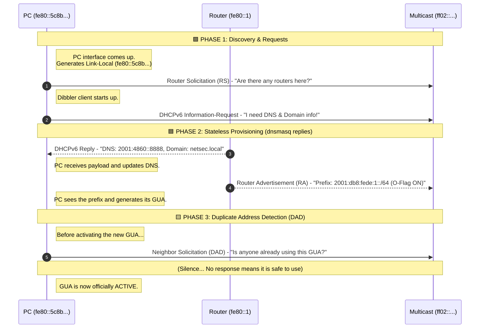

# Task 
>One router with one lan with 2 pcs.  
>The assignment is: to configure the topology to use dynamic IPv6 addresses.  
>You have to use SLAAC+DHCPv6 to provide GUA addresses to the machines in the lan. It is a stateless dynamic addressing.  
>You have to properly set up the addresses of r1 and dnmasq and to properly set up the pc configurations.
>
>- lan has the subnet 2001:DB8:FEDE:1::/64 and 192.168.100.0/24
>- you can also setup the domain name (es: netsec.local)
>- r1 uses as DNS servers 8.8.8.8 and 2001:4860:4860::8888
>- pc1 and pc2 must obtain the address via SLAAC and the DNS+domain info via stateless DHCPv6
>- pc1 has to use dibbler-client
>   - you can install it using dpkg -i /shared/dibbler-client*
>- pc2 has to use dhclient 
>- the router has always 1 in the host part of its own address even in its local-link address.

# Solution
First of all we configure `r1` to have the requested addresses.

📄 **File:** `r1.startup`
```bash
# 0. Install dependencies
echo 'debconf debconf/frontend select Noninteractive' | debconf-set-selections
dpkg -i /shared/*.deb
apt install -yf dnsmasq

# 1. NAT all traffic directed outside the LAN
iptables -t nat -A POSTROUTING -o eth1 -j MASQUERADE

# 2. Flush the interface
ip addr flush eth0

# 3. Add the IPv4 Address
ip addr add 192.168.100.1/24 dev eth0

# 4. Add the IPv6 GUA Address
ip addr add 2001:db8:fede:1::1/64 dev eth0

# 5. Add the IPv6 Link-Local Address
ip addr add fe80::1/64 dev eth0

# 6. Set the DNS servers
echo 'nameserver 8.8.8.8' > /etc/resolv.conf
echo 'nameserver 2001:4860:4860::8888' >> /etc/resolv.conf

# 7. Startup the DHCPv6 server (dnsmasq)
dnsmasq
```

We must configure `dnsmasq`, to do the stateless Router Advertisements and to act as a DHCPv6 Server, and to act as a DHCPv4 server too.


📄 **File:** `r1/etc/dnsmasq.conf`
```bash
interface=eth0

# --- IPv4 Configuration (DHCPv4) ---
# Give out IPv4 addresses, the IPv4 router (gateway), and the IPv4 DNS
dhcp-range=192.168.100.10, 192.168.100.100, 24h
dhcp-option=option:router, 192.168.100.1
dhcp-option=option:dns-server, 8.8.8.8

# --- IPv6 Configuration (SLAAC + Stateless DHCPv6) ---
# Enable Router Advertisements for SLAAC, and pass the IPv6 DNS/Domain
enable-ra
dhcp-range=2001:DB8:FEDE:1::, ra-stateless, 64
dhcp-option=option6:dns-server, [2001:4860:4860::8888]
dhcp-option=option6:domain-search, netsec.local
```


## PC1
To configure PC1 we first have to create the config file for `dibbler`.


📄 **File:** `pc1/etc/dibbler/client.conf`
```bash
# Configure the interface for stateless operation
iface eth0 {
    stateless
    option dns-server
    option domain
}
```

Then we configure the startup file.

📄 **File:** `pc1.startup`
```bash
# 0. Install dependencies
dpkg -i /shared/dibbler-client*.deb
apt install -y dibbler-client

# 1. Disable forwarding
sysctl -w net.ipv6.conf.eth0.forwarding=0

# 2. Accept Router Advertisements
sysctl -w net.ipv6.conf.eth0.accept_ra=1

# 3. Start dibbler
dibbler-client start
```

## PC2
To configure PC2 we just need to say to `dhclient` what to use.
```bash
# 1. Disable forwarding
sysctl -w net.ipv6.conf.eth0.forwarding=0

# 2. Accept Router Advertisements
sysctl -w net.ipv6.conf.eth0.accept_ra=1

# 3. Run dhclient in stateless mode
dhclient -6 -S eth0

# 4. Set the DNS servers
echo 'nameserver 2001:4860:4860::8888' > /etc/resolv.conf
```

# Tests
To make sure our lab is configured correctly, we can do some tests.

First let's start the lab ([take a look at the git alias](../../README.md#color-coded-terminal-launcher-lstartsh)) on our host machine.
```bash
host:~$ git lstart
```

## Check Addresses

First of all let's check that the hosts correctly generated their addresses with SLAAC.

### PC1
```console
root@pc1:/# ip -6 a s eth0
550: eth0@if549: <BROADCAST,MULTICAST,UP,LOWER_UP> mtu 1500 qdisc noqueue state UP group default qlen 1000 link-netnsid 0
    inet6 2001:db8:fede:1:8c96:68ff:fe8c:7136/64 scope global dynamic mngtmpaddr proto kernel_ra 
       valid_lft forever preferred_lft forever
    inet6 fe80::8c96:68ff:fe8c:7136/64 scope link proto kernel_ll 
       valid_lft forever preferred_lft forever
```
We have:
- GUA Address: `2001:db8:fede:1:8c96:68ff:fe8c:7136/64 `
- Link-Local address: `fe80::8c96:68ff:fe8c:7136/64`

### PC2

```console
root@pc2:/# ip -6 a s eth0
555: eth0@if554: <BROADCAST,MULTICAST,UP,LOWER_UP> mtu 1500 qdisc noqueue state UP group default qlen 1000 link-netnsid 0
    inet6 2001:db8:fede:1:d403:e4ff:fe99:7bf5/64 scope global dynamic mngtmpaddr proto kernel_ra 
       valid_lft forever preferred_lft forever
    inet6 fe80::d403:e4ff:fe99:7bf5/64 scope link proto kernel_ll 
       valid_lft forever preferred_lft forever
```

We have:
- GUA Address: `2001:db8:fede:1:d403:e4ff:fe99:7bf5/64`
- Link-Local address: `fe80::d403:e4ff:fe99:7bf5/64 `

## Connectivity Tests
To ensure that the LAB is configured correctly, we can make the hosts ping each other.

- [x] **PC1 to PC2** (GUA Address):
  ```console
  root@pc1:/# ping6 -c 1 2001:db8:fede:1:d403:e4ff:fe99:7bf5
  ```
- [x] **PC2 to Gateway** (GUA Address):
  ```console
  root@pc2:/# ping6 -c 1 2001:db8:fede:1::1
  ```
- [x] **PC1 to Gateway** (Link-Local):
  ```console
  root@pc1:/# ping6 -c 1 fe80::1%eth0
  ```


# Capturing Router Advertisement Packet
As part of the task, we have to capture the Router Advertisement Packets sent from `r1`.

First of all let's comment the startup of `dnsmasq` on `r1`, to start it manually.

📄 **File:** `r1.startup`
```bash
... [rest of the config] ...

# 7. Startup the DHCPv6 server (dnsmasq)
# dnsmasq
```

## Setup the listener
First let's [start the lab](../../README.md#color-coded-terminal-launcher-lstartsh) on our host machine.
```bash
host:~$ git lstart
```

Then we must [connect to the lan](../../README.md#host-to-lab-network-bridge), using an available address.
```bash
host:~$ git connect-lab 2001:db8:fede:1::101/64 lan
```

We then open `wireshark`, and start to **listen** on the `veth0` interface.

Then we start `dnsmasq` on `r1`.
```console
root@r1:/# dnsmasq -d
```

We can see the packets being captured from Wireshark.
We can find the results in [dhcp6.pcap](./captures/dhcp6.pcap).

Analyzing it:


> [!NOTE]
> In this case we can see that the SLAAC generation of the GUA of `pc` actually happens **after** receiving the DNS and domain, because they are actually separated, and in this case the DHCP server replied before `r1` sent the Router Advertisement for the prefix.
