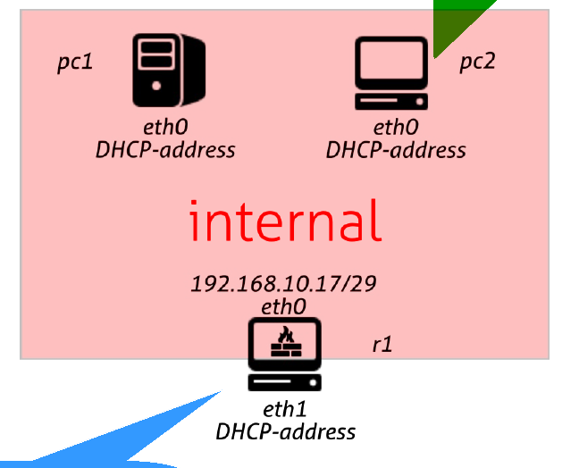

# Task
> One router with two lan, both with 2 pcs. The router is connected with an ISP router.
> The assignment is: to configure the topology to use IPv6 addresses.
> 
> The ISP makes use of a DHCPv6 server for address and prefix distribution.
> 
> The router has to ask prefixes to its ISP and has to distribute addresses inside the two lans, using SLAAC.
> 
> You are supposed to configure a DHCPv6 client to make r1 asking for prefix delegation and (optionally) for an address and to make router advertisements with the received prefixes.
> 
> The ISP is already configure to provide prefixes, while the router and the pcs have to be configured.
> 
> You can use dibbler+radvd or dhcp6c+dnsmasq.
> 
> - the router has always 1 in the host part of its own link local address.
> 
> - With dibbler, you will have to use a script to make router assigning an address to the interface in the network of the prefix. This will be used as the address radvd will advertise in the network for SLAAC configuration.

## Topology
<p align="center">
  
</p>

# Solution
As the tools used I'm going with `dhcp6c` + `dnsmasq`.

We must start configuring `r1`.
## R1
We must first configure `dhcp6c`,in particular it has to talk to `isp` on `eth0`, ask for **Prefix Delegation** and assign the resulting `/64` subnets to the LAN interfaces (`eth1` and `eth2`).

📄 **File:** `r1/etc/dhcp6c.conf`
```bash
interface eth0 {
    send ia-na 0;    # Ask for a normal IP address for eth0
    send ia-pd 0;    # Ask for the Prefix Delegation for the LANs
};

id-assoc na 0 {
    # This just tells dhcp6c to accept the address the ISP gives it for eth0
};

id-assoc pd 0 {
    prefix-interface eth1 {
        sla-id 1;
        sla-len 8;
    };
    prefix-interface eth2 {
        sla-id 2;
        sla-len 8;
    };
};
```

> [!NOTE]
> In this case the `sla-len` is the different in the length of the subnets.  
> The `isp` gives to `r1` subnets with `/56`, it then needs to give them to its lans as `/64`, so the length, in bits, of the subnets is 8.

Then we have to configure `dnsmasq` to broadcast RAs to the LANs to perform SLAAC, since we don't know in advance the prefixes, we have to use the **constructor** feature.


📄 **File:** `r1/etc/my_dnsmasq.conf`
```bash
# Listen only on the LAN interfaces
interface=eth1
interface=eth2

# Enable Router Advertisements
enable-ra

# The "constructor" dynamically looks at eth1 and eth2. 
# Whatever Global Unicast Address it finds there, it will advertise that prefix via SLAAC (ra-only).
dhcp-range=::,constructor:eth1,ra-only,64
dhcp-range=::,constructor:eth2,ra-only,64
```

> [!WARNING]
> Pay attention that the file in which you write the `dnsmasq` configuration is not `/etc/dnsmasq.conf`, because when in the startup file `dnsmasq` gets installed, it overwrites that file and you lose the configuration.

📄 **File:** `r1.startup`
```bash
# 0. Install dependencies
echo 'debconf debconf/frontend select Noninteractive' | debconf-set-selections
umount /etc/resolv.conf
dpkg -i --force-confold /shared/*.deb

# 1. Flush the pre-generated addressess
ip addr flush dev eth0
ip addr flush dev eth1
ip addr flush dev eth2

# 2. Set the Link-Local addresses with ::1 in the Host
ip addr add fe80::1/64 dev eth0
ip addr add fe80::1/64 dev eth1
ip addr add fe80::1/64 dev eth2

# 3. Start the dhcp6c client and wait to receive the prefixes
dhcp6c -c /etc/dhcp6.conf eth0
sleep 2

# 4. Start dnsmasq to send RAs
dnsmasq
```

# Tests
To make sure our lab is configured correctly, we can do some tests.

First let's start the lab ([take a look at the git alias](../../README.md#color-coded-terminal-launcher-lstartsh)) on our host machine.
```bash
host:~$ git lstart
```

## Check Addresses
We can then check that every Host is correctly generating/receiving the IPs.

### ISP
We can check:
```console
root@isp:/# ip -6 a s eth0
840: eth0@if839: <BROADCAST,MULTICAST,UP,LOWER_UP> mtu 1500 qdisc noqueue state UP group default qlen 1000 link-netnsid 0
    inet6 fe80::fc8a:97ff:fe65:a0b2/64 scope link proto kernel_ll 
       valid_lft forever preferred_lft forever
```

### R1
We can check:
```console
root@r1:/# ip -6 a s
1: lo: <LOOPBACK,UP,LOWER_UP> mtu 65536 state UNKNOWN qlen 1000
    inet6 ::1/128 scope host proto kernel_lo 
       valid_lft forever preferred_lft forever
842: eth0@if841: <BROADCAST,MULTICAST,UP,LOWER_UP> mtu 1500 state UP qlen 1000
    inet6 2001:db8:fade:2:662d:79a9:7eee:bb19/128 scope global 
       valid_lft forever preferred_lft forever
    inet6 fe80::1/64 scope link 
       valid_lft forever preferred_lft forever
844: eth1@if843: <BROADCAST,MULTICAST,UP,LOWER_UP> mtu 1500 state UP qlen 1000
    inet6 2001:db8:fede:4901:703e:37ff:fea6:320a/64 scope global 
       valid_lft forever preferred_lft forever
    inet6 fe80::1/64 scope link 
       valid_lft forever preferred_lft forever
846: eth2@if845: <BROADCAST,MULTICAST,UP,LOWER_UP> mtu 1500 state UP qlen 1000
    inet6 2001:db8:fede:4902:1c69:fff:fe01:2bf2/64 scope global 
       valid_lft forever preferred_lft forever
    inet6 fe80::1/64 scope link 
       valid_lft forever preferred_lft forever
```

### PC1
We can check:
```console
root@pc1:/# ip -6 a s eth0
848: eth0@if847: <BROADCAST,MULTICAST,UP,LOWER_UP> mtu 1500 qdisc noqueue state UP group default qlen 1000 link-netnsid 0
    inet6 2001:db8:fede:4901:90df:fff:fe6f:a69f/64 scope global dynamic mngtmpaddr proto kernel_ra 
       valid_lft forever preferred_lft forever
    inet6 fe80::90df:fff:fe6f:a69f/64 scope link proto kernel_ll 
       valid_lft forever preferred_lft forever
```

Soi we have:
- GUA: `2001:db8:fede:4901:90df:fff:fe6f:a69f/64`
- Link-Local: `fe80::90df:fff:fe6f:a69f/64`

### PC2
We can check:
```console
root@pc2:/# ip -6 a s eth0
850: eth0@if849: <BROADCAST,MULTICAST,UP,LOWER_UP> mtu 1500 qdisc noqueue state UP group default qlen 1000 link-netnsid 0
    inet6 2001:db8:fede:4901:b434:64ff:fece:5d7/64 scope global dynamic mngtmpaddr proto kernel_ra 
       valid_lft forever preferred_lft forever
    inet6 fe80::b434:64ff:fece:5d7/64 scope link proto kernel_ll 
       valid_lft forever preferred_lft forever
```

Soi we have:
- GUA: `2001:db8:fede:4901:b434:64ff:fece:5d7/64`
- Link-Local: `fe80::b434:64ff:fece:5d7/64`


### PC3
We can check:
```console
root@pc3:/# ip -6 a s eth0
854: eth0@if853: <BROADCAST,MULTICAST,UP,LOWER_UP> mtu 1500 qdisc noqueue state UP group default qlen 1000 link-netnsid 0
    inet6 2001:db8:fede:4902:e83b:fff:fe2d:5189/64 scope global dynamic mngtmpaddr proto kernel_ra 
       valid_lft forever preferred_lft forever
    inet6 fe80::e83b:fff:fe2d:5189/64 scope link proto kernel_ll 
       valid_lft forever preferred_lft forever
```

Soi we have:
- GUA: `2001:db8:fede:4902:e83b:fff:fe2d:5189/64`
- Link-Local: `fe80::e83b:fff:fe2d:5189/64`

### PC4
We can check:
```console
root@pc4:/# ip -6 a s eth0
852: eth0@if851: <BROADCAST,MULTICAST,UP,LOWER_UP> mtu 1500 qdisc noqueue state UP group default qlen 1000 link-netnsid 0
    inet6 2001:db8:fede:4902:b437:90ff:fea0:641a/64 scope global dynamic mngtmpaddr proto kernel_ra 
       valid_lft forever preferred_lft forever
    inet6 fe80::b437:90ff:fea0:641a/64 scope link proto kernel_ll 
       valid_lft forever preferred_lft forever
```

Soi we have:
- GUA: `2001:db8:fede:4902:b437:90ff:fea0:641a/64`
- Link-Local: `fe80::b437:90ff:fea0:641a/64`


  ## Connectivity Tests
To ensure that the LAB is configured correctly, we can make the hosts ping each other.

- [x] **PC1 to PC2** (Intra-LAN GUA Address):
  ```console
  root@pc1:/# ping6 -c 1 2001:db8:fede:4901:b434:64ff:fece:5d7
  ```
- [x] **PC1 to PC3** (Inter-LAN GUA Address):
  ```console
  root@pc1:/# ping6 -c 1 2001:db8:fede:4902:e83b:fff:fe2d:5189
  ```
- [x] **PC1 to R1 WAN** (LAN to Edge GUA Address):
  ```console
  root@pc1:/# ping6 -c 1 2001:db8:fade:2:662d:79a9:7eee:bb19
  ```
- [x] **PC1 to Gateway** (Link-Local Address):
  ```console
  root@pc1:/# ping6 -c 1 fe80::1%eth0
  ```
- [x] **PC1 to All-Nodes** (Multicast Ping Sweep):
  ```console
  root@pc1:/# ping6 -c 2 ff02::1%eth0
  ```
