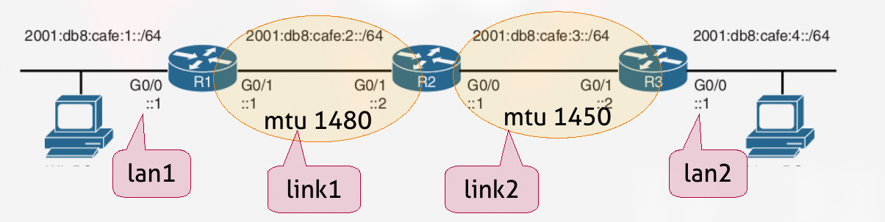

# Task
> Three routers connecting two lans with one pc each. The assignment is: to configure the topology to use static addressing for the routers and SLAAC IPv6 addresses for the two lans.  
Moreover, you have to play with the MTU of the links between the routers to generate and  capture ICMPv6 packets (Packet too big or MTU discovery). 

> The routers have to be configured as such:
> - r1.eth0 2001:db8:cafe:1::1/64
> - r1.eth1 2001:db8:cafe:2::1/64
> - r2.eth0 2001:db8:cafe:2::2/64
> - r2.eth1 2001:db8:cafe:3::1/64
> - r3.eth0 2001:db8:cafe:3::2/64
> - r3.eth1 2001:db8:cafe:4::1/64

> - All the pcs of the topology must have GUA addresses via SLAAC.
> 
> - Remember to add static routes for the networks.
> 
> - You can use ping or tracepath to generate traffic in the network.
> 
> - To change the mtu of a link you can use the ip link set mtu command
>   on both the end points of the link.

## Topology
<p align="center">
  
</p>

# Solution

The solution it's pretty straight forward.

## R1
We setup `radvd` on `r1` to make him send RAs for pc1 to configure with SLAAC.

📄 **File:** `r1/etc/network/interfaces`
```bash
iface eth0 inet6 static
  address 2001:db8:cafe:1::1
  netmask 64
  dad-attempts 0
```

📄 **File:** `r1/etc/radvd.conf`
```bash
interface eth0
{
    AdvSendAdvert on;
    MinRtrAdvInterval 15;
    MaxRtrAdvInterval 30;
    prefix 2001:db8:cafe:1::/64 {
        AdvOnLink on;
        AdvAutonomous on;
        AdvRouterAddr on;
    };
};
```

📄 **File:** `r1.startup`
```bash
# 0. Install and start radvd for sending RAs and do SLAAC
dpkg -i radvd_1%3a2.15-2_amd64.deb
ifup eth0
radvd -m logfile -l /var/log/radvd.log

# 1. Set the IP of interface eth1 towards r2
ip addr add 2001:db8:cafe:2::1/64 dev eth1

# 2. Set the default route through r2
ip route add default via 2001:db8:cafe:2::2

# 3. Set the MTU of link1
ip link set mtu 1480 dev eth1
```

## R2
`r2` should know where to find the `lan1` and `lan2`, so we have to set the routes.  
Here we set the MTU for `link1` and `link2` too.

📄 **File:** `r2.startup`
```bash
# 1. Set the IP of interfaces
ip addr add 2001:db8:cafe:2::2/64 dev eth0
ip addr add 2001:db8:cafe:3::1/64 dev eth1

# 2. Set the routes
ip route add 2001:db8:cafe:1::/64 via 2001:db8:cafe:2::1
ip route add 2001:db8:cafe:4::/64 via 2001:db8:cafe:3::2

# 3. Set the MTUs
ip link set mtu 1480 dev eth0
ip link set mtu 1450 dev eth1

```

## R3
As we did on `r1`, here on `r3` too we have to set `radvd`.


📄 **File:** `r3/etc/network/interfaces`
```bash
iface eth1 inet6 static
  address 2001:db8:cafe:4::1
  netmask 64
  dad-attempts 0
```

📄 **File:** `r3/etc/radvd.conf`
```bash
interface eth1
{
    AdvSendAdvert on;
    MinRtrAdvInterval 15;
    MaxRtrAdvInterval 30;
    prefix 2001:db8:cafe:4::/64 {
        AdvOnLink on;
        AdvAutonomous on;
        AdvRouterAddr on;
    };
};
```


📄 **File:** `r3.startup`
```bash
# 0. Install and start radvd for sending RAs and do SLAAC
dpkg -i radvd_1%3a2.15-2_amd64.deb
ifup eth1
radvd -m logfile -l /var/log/radvd.log

# 1. Set the IP of interface eth0 towards r2
ip addr add 2001:db8:cafe:3::2/64 dev eth0

# 2. Set the default route through r2
ip route add default via 2001:db8:cafe:3::1

# 3. Set the MTU of link2
ip link set mtu 1450 dev eth0
```

# Tests
To make sure our lab is configured correctly, we can do some tests.

First let's start the lab ([take a look at the git alias](../../README.md#color-coded-terminal-launcher-lstartsh)) on our host machine.
```bash
host:~$ git lstart
```

First of all we check the IP of `pc2`.

```console
root@pc2:/# ip -6 a s eth0
48: eth0@if47: <BROADCAST,MULTICAST,UP,LOWER_UP> mtu 1500 qdisc noqueue state UP group default qlen 1000 link-netnsid 0
    inet6 2001:db8:cafe:4:64e1:b9ff:feea:6fb1/64 scope global dynamic mngtmpaddr proto kernel_ra 
       valid_lft 86374sec preferred_lft 14374sec
    inet6 fe80::64e1:b9ff:feea:6fb1/64 scope link proto kernel_ll 
       valid_lft forever preferred_lft forever
```

So we have:
- GUA: `2001:db8:cafe:4:64e1:b9ff:feea:6fb1/64`

We can then start `tcpdump` on our routers, to analyze in different points what the packets go through.

```console
root@r1:/# tcpdump -w /shared/r1.pcap
```
```console
root@r2:/# tcpdump -w /shared/r2.pcap
```
```console
root@r3:/# tcpdump -w /shared/r3.pcap
```

## Not fragmented ping
And finally we can start the ping from `pc1`, setting a big payload (bigger than the MTU):
```console
ping -s 1452 -M do 2001:db8:cafe:4:64e1:b9ff:feea:6fb1
```
In this case the flags:
- **-s**: sets the payload size to 1452 + 8 (ICMP Header)
- **-M do**: sets the *Don't Fragment* flag, and starts the PMTUD (Path MTU Discovery).

We can see the results, at different stages in:
- [r1.pcap](./captures/r1.pcap)
- [r2.pcap](./captures/r2.pcap)
- [r3.pcap](./captures/r3.pcap)


## Fragmented ping
If we remove the *Don't Fragment* flag, we can see that instead the ping goes through.
```console
ping -s 1452 2001:db8:cafe:4:64e1:b9ff:feea:6fb1
```

We can see the results, at different stages in:
- [r1-frag.pcap](./captures/r1-frag.pcap)
- [r2-frag.pcap](./captures/r2-frag.pcap)
- [r3-frag.pcap](./captures/r3-frag.pcap)

